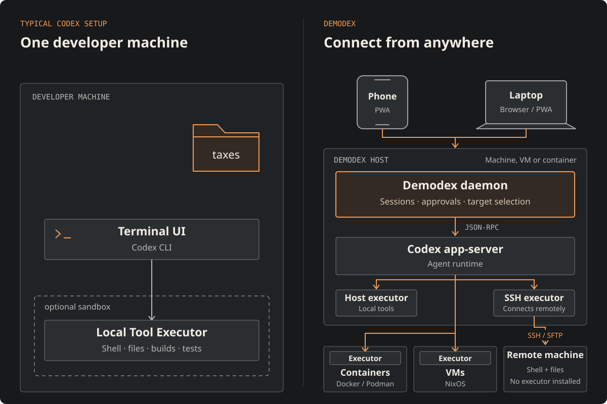
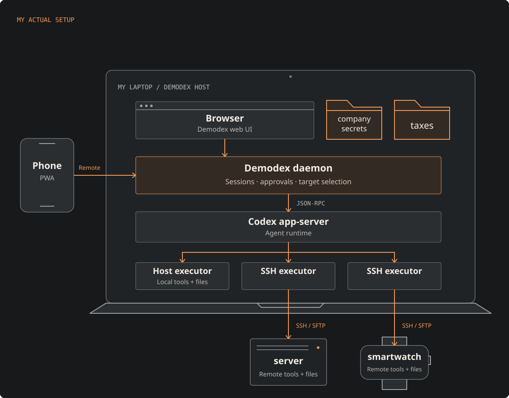

# // DEMODEX

## What it is, and isn't

Demodex is a thin layer above (and optionally below) the OpenAI(tm) `codex` cli, allowing remote access and isolation between agent runtime and tool execution.

**It is _not_ another harness (like OpenCode), and it does _not_ support different backends (like ACP)**.

Above codex, it provides a webui to remotely access codex sessions, controlling codex cli through the `app-server` JSON-RPC interface.

Below codex, it uses the codex executor interface to run zero or more execution backends (where the tools are executed). These can run directly on the host, in a container/VM, or, using a custom SSH executor, can access a remote machine through SSH _**without having to install a server on that machine**_.

The default setup of both codex-cli and claude-code is that you run the terminal app on your developer machine, and the agent runs the tools in the same process, maybe a sub-process (codex added a shared daemon with the latest update), but definitely on the same machine.

With demodex, you can run the demodex server and codex app-server on one machine, including in a container or VM if you so desire, connect to it from multiple remote devices, even at the same time, and can select where tools execute per-session, even change it during a session.



Note that even though they are drawn separately, you can obviously run both demodex and one or more executors directly on your dev PC, either on the host, or in VMs. You do **not** need a complicated, multi-machine cloud setup, demodex is very explicitly there to give you full, **local** control.

Now, personally, I always used `codex -s danger-full-access`, and continue to use demodex in host mode, so this added isolation is a nice theoretical property, but I trust the model, the model hasn't let me down so far. What it does add for me is remote access from my phone (through tailscale), and the ability to access *additional* targets.



# Usage

So, with all that out of the way, how do you actually use it? Here's a short video showing the main interface, and how you can change the available executors at runtime.


https://github.com/user-attachments/assets/a41295a3-a5f4-4556-9a33-7fcda0824082

## Setup

Demodex does not embed codex, you need to install it, depending on your os.

You can configure whether it should share authentication and session storage with your normal user profile, or have its own codex directory.

The demodex webui supports token authentication or tailscale authentication. It does **not** have any multi-user features. There's one token, and one list of sessions.

If you use nix, this repo contains the files I use to host it on my system.

The webui is a PWA and can be pinned to the home screen on mobile devices. It will detect updates when you update the service and prompt for update and reload.

### Recommended setup

Install and configure both codex and tailscale. Ask your agent to scan the repository for malicious code (important!) and to set it up on your system. :)

## Development and Contribution

Conversation code blocks tagged `eod`, `apt`, or `apteronotus` offer an **Open
Apteronotus score** button. The embedded editor loads the exact score; **Run**
starts synthesis and **Close player** tears down playback. Ordinary Lua snippets
do not offer playback. This uses the Apteronotus web component, initialized only
when opened, with no redirect or score text in a URL.

To include the player in a frontend release, build Apteronotus first, then bundle
its generated package with Demodex:

```sh
# In the Apteronotus checkout:
./tools/build-web.sh --locked
# In the Demodex development shell:
uv run tools/build-web.py --apteronotus-pkg ../apteronotus/web/pkg
```

The player is served from the same origin under a content-derived asset path.
The PWA verifies and caches those static assets with the release; initialization
is on demand, but installing the PWA downloads the bundled player for offline
use. Builds without `--apteronotus-pkg` show an explicit unavailable-player
message. Source-file acquisition from execution targets is separate from this
text embedding.

It works for me, my next planned steps are probably improving the multi-executor workflow and adding tools to copy files and folders between executors.

If you're here, you're a vibecoder. Please don't send PRs, I'm not gonna merge any PRs. Open an issue, if you have changes, push them to a branch and link the branch. I'll tell my agent to look at it.

## License

This is vibe-engineered, as such I'm happy to put it into the public domain. My contributions are dual-licensed under cc0 and MIT, at your convenience; for referenced crates and libraries, their respective licenses apply.
